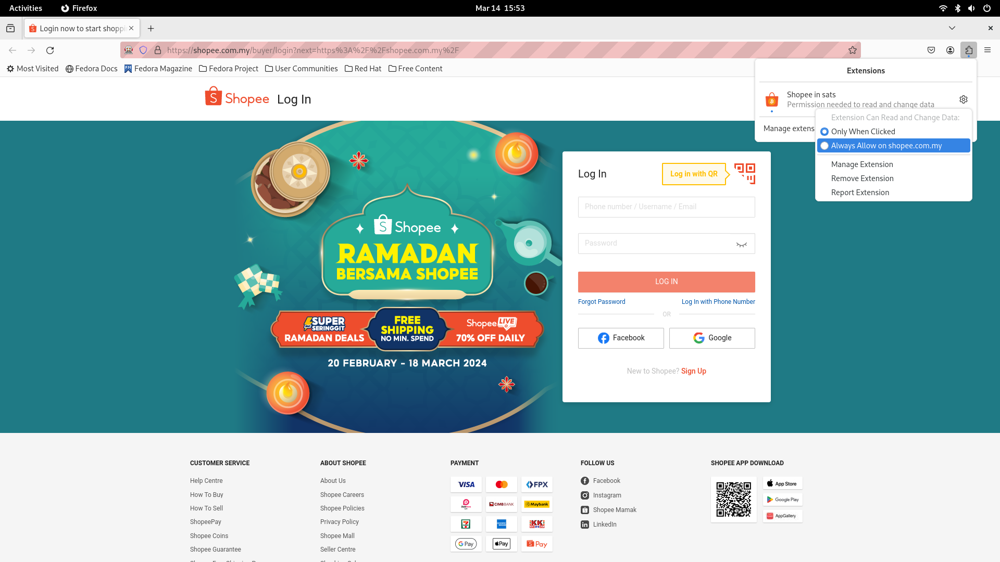
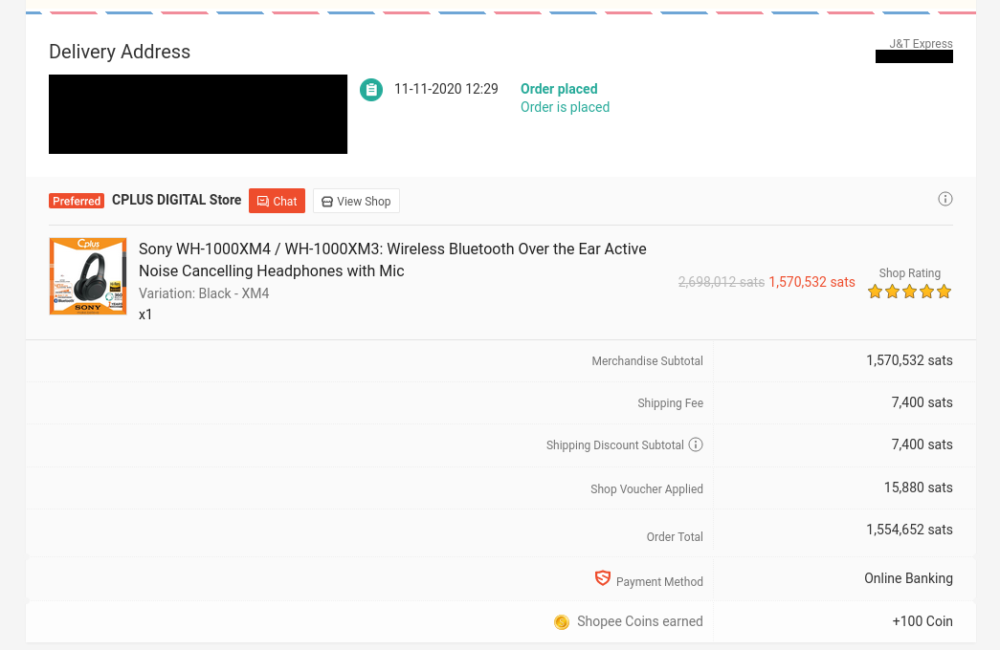
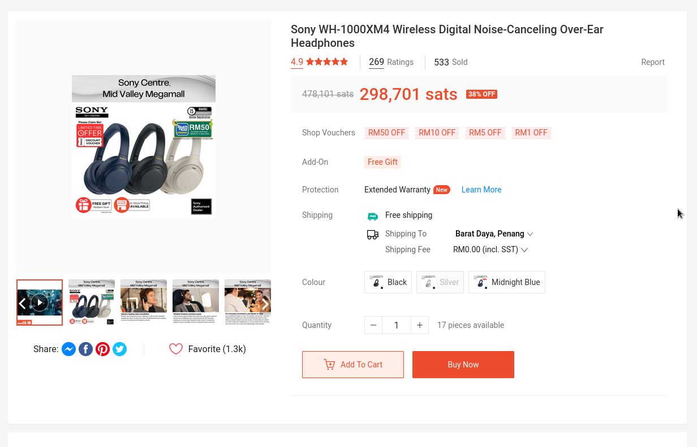

# Shopee in sats

## Description

A web extension that converts prices on shopee.com.my to satoshis.

## Motivation

> Measured in bitcoin terms, prices of everything else is going to come down forever. The problem is people are measuring in fiat terms thinking prices are going up forever. But measured in bitcoin, everything will come down forever. - Jeff Booth

_the quote above was extracted from [InvestAnswer's podcast with Jeff Booth](https://www.youtube.com/live/5K6JPXlVh-Y?feature=shared&t=3114)_

I wanted to prove Jeff Booth's thesis that prices of goods should go down in bitcoin terms. So, I developed this extension that reads pages on [shopee.com.my](https://shopee.com.my) and converts the prices from fiat (Malaysian Ringgit) to satoshis. Guess what? Jeff was right. Looking back at the stuff I purchased 4+ years ago, their prices have gone down massively while their fiat prices have gone up or stayed constant.

## Contributing/Usage

Before continuing, you will need to have [NodeJS](https://nodejs.org/en/download/current), preferably v20+ installed. You should also have the Firefox browser installed, as that is what I have mainly been developing on.

### Clone the repository and install dependencies

```
git clone https://github.com/danielzairin/shopee-in-sats
cd shopee-in-sats/
npm install
```

### Run the extension

```
npx web-ext run -s extension/
```

This will open a firefox browser window with the extension installed.

### Test out the extension

#### Visit https://shopee.com.my

#### Give permission to the extension by clicking on the top-right "Extensions" icon:



#### Search for a product or view a product's page. The prices should be in satoshis.


### Code

All the source code for the extension lives in the `/extension` directory. If you've never built an web extension before, I recommend going through the [MDN docs on web extensions](https://developer.mozilla.org/en-US/docs/Mozilla/Add-ons/WebExtensions) for guidance.

## Number go up, price go down

I bought these headphones in 2020 for RM1000, they were 1.57 million sats back then.



That same headphone brand new sells for the same RM1000 today. When priced in satoshis however, it has gone down to 300k sats.


